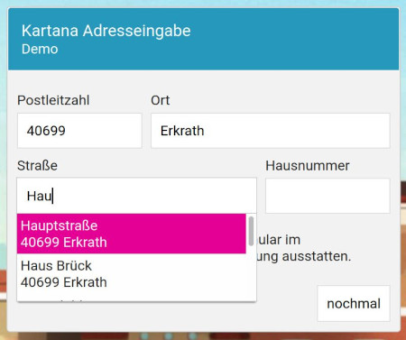

# Kartana - Autovervollständigung für Adressen

Kartana rüstet Adressformulare mit automatischer Vervollständigung aus. Während der Adresseingabe werden passende Adressen vorgeschlagen. Das ist komfortabel für den Benutzer und
sorgt zugleich für eine verbesserte Datenqualität. Tippfehler gehören der Vergangenheit an.

* Deutschlandweit
* Kostenlos
* Frei lizenzierte Daten
* Leicht zu integrieren

Live-Demo und Anleitungen findest du auf [kartana.de](https://kartana.de).

## Version 1.3
Release am ____.2022

**Client**
* Wordumbrüche in Adressvorschlägen werden standardmäßig vermieden.

## Version 1.2
Release am 22.02.2022

**Client**
* Das Vorschlagsmenü wird nun rechtsbündig angezeigt, wenn auf diese Weise horizontales Scrollen vermieden werden kann.

## Version 1.1
Release am 30.01.2022

**API**
* Vorschläge für Straßen berücksichtigen nun auch den Ortsnamen (statt bisher nur die Postleitzahl).
* Vorschläge für Postleitzahlen berücksichtigen nun auch den Ortsnamen
* Fix für Synonyme 

**Client**
* Mit ESC kann nun das Vorschlagsmenü geschlossen werden. Bei geschlossenem Menü wird mit TAB die Eingabe unverändert übernommen. 

## Version 1.0
Go Live am 06.11.2021
